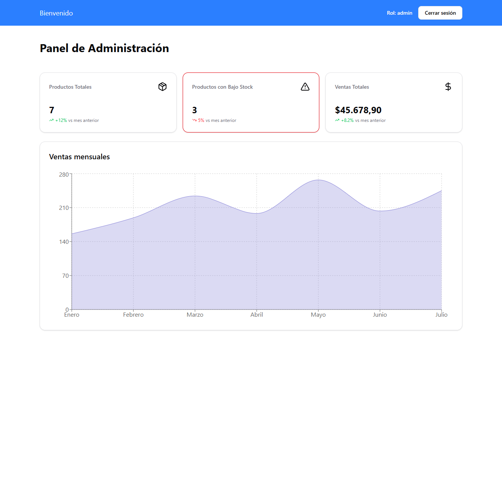

# 🛍️ Tienda Online - Prueba Técnica Full Stack

Una aplicación full-stack completa para gestión de productos con autenticación de usuarios, roles de administrador y cliente, y dashboard con métricas.

## 📋 Características Principales

### 🔐 Autenticación y Autorización
- Registro y login de usuarios
- Autenticación JWT
- Roles: **Admin** y **Cliente**
- Protección de rutas por rol
- Middleware de autenticación

### 📦 Gestión de Productos (CRUD Completo)
- **Crear** productos con imagen
- **Leer** lista de productos con filtros
- **Actualizar** productos existentes
- **Eliminar** productos
- Campos: nombre, descripción, precio, imagen, stock, categoría
- Validaciones en frontend y backend
- Filtros por nombre y categoría
- Paginación
- Subida de imágenes a Cloudinary

### 📊 Dashboard de Administrador
- Total de productos en el sistema
- Productos con bajo stock (< 3 unidades)
- Ventas simuladas con datos mock
- Gráfico de ventas mensuales con Recharts
- Métricas con indicadores de tendencia

### 🎨 Interfaz de Usuario
- Diseño responsive (mobile-first)
- Componentes reutilizables
- Feedback visual para errores y cargas
- Navegación intuitiva
- UI moderna con Tailwind CSS

## 🛠️ Stack Tecnológico

### Frontend
- **Next.js 15.3.4** (App Router)
- **TypeScript** 
- **Tailwind CSS v4**
- **React 19**
- **Zustand** (gestión de estado)
- **TanStack Table** (paginación y filtros)
- **Recharts** (gráficos)
- **Radix UI** (componentes)
- **Lucide React** (iconos)

### Backend
- **Node.js**
- **Express.js**
- **MongoDB** con **Mongoose**
- **JWT** (jsonwebtoken)
- **bcrypt** (hash de contraseñas)
- **Multer** (manejo de archivos)
- **Cloudinary** (almacenamiento de imágenes)
- **CORS** habilitado

### Base de Datos
- **MongoDB** (base de datos NoSQL)
- **Mongoose** (ODM)

### Autenticación
- **JWT** (JSON Web Tokens)
- **bcrypt** para hash de contraseñas

### Almacenamiento
- **Cloudinary** para imágenes

## 📁 Estructura del Proyecto

```
prueba-tecnica/
├── backend/
│   ├── controllers/
│   │   ├── auth.js          # Autenticación
│   │   ├── products.js      # CRUD productos
│   │   └── admin.js         # Endpoints admin
│   ├── middleware/
│   │   └── middleware.js    # Auth y logging
│   ├── models/
│   │   ├── user.js          # Modelo usuario
│   │   └── product.js       # Modelo producto
│   ├── utils/
│   │   ├── config.js        # Variables de entorno
│   │   ├── db.js           # Conexión MongoDB
│   │   └── cloudinary.js   # Config Cloudinary
│   ├── requests/
│   │   └── auth.rest       # Tests de API
│   ├── app.js              # Config Express
│   └── index.js            # Servidor
├── frontend/
│   ├── src/
│   │   ├── actions/        # Server actions
│   │   ├── app/           # App Router
│   │   │   ├── admin/     # Rutas admin
│   │   │   ├── cliente/   # Rutas cliente
│   │   │   ├── login/     # Autenticación
│   │   │   └── register/  # Registro
│   │   ├── components/    # Componentes React
│   │   │   ├── admin/     # Componentes dashboard
│   │   │   ├── auth/      # Formularios auth
│   │   │   ├── products/  # CRUD productos
│   │   │   └── ui/        # Componentes base
│   │   ├── lib/           # Utilidades y tipos
│   │   └── hooks/         # Custom hooks
│   └── public/            # Assets estáticos
└── README.md
```

## 🚀 Instalación y Configuración

### Prerrequisitos
- Node.js (versión 18 o superior)
- MongoDB (local o Atlas)
- Cuenta en Cloudinary

### 1. Clonar el repositorio
```bash
git clone https://github.com/GonzaloHaag/prueba-tecnica-tienda-online.git
cd prueba-tecnica
```

### 2. Configurar Backend

```bash
cd backend
npm install
```

Clonar archivo `.env.template` y renombrarlo a `.env` en la carpeta `backend/`:
```env
PORT=TU PUERTO
MONGODB_URI=TU MONGO DB URI
JWT_SECRET=tu_jwt_secret_super_seguro
CLOUDINARY_SECRET=tu_cloudinary_secret
```

### 3. Configurar Frontend

```bash
cd ../frontend
npm install
```

Crear archivo `.env` en la carpeta `frontend/`:
```env
API_URL=http://localhost:3001/api
```

### 4. Configurar Cloudinary
1. Crear cuenta en [Cloudinary](https://cloudinary.com/)
2. Obtener las credenciales de la API
3. Actualizar `backend/utils/cloudinary.js` con tus credenciales

### 5. Ejecutar el proyecto

**Terminal 1 - Backend:**
```bash
cd backend
npm run dev
```

**Terminal 2 - Frontend:**
```bash
cd frontend
npm run dev
```

### 6. Acceder a la aplicación
- Frontend: http://localhost:3000
- Backend: http://localhost:3001

## 👥 Usuarios de Prueba

### Usuario Administrador (Fijo)
```json
{
  "email": "admin@test.com", 
  "password": "123456"
}
```

### Usuario Cliente (Registro Libre)
Puedes registrar cualquier usuario cliente con:
```json
{
  "email": "tu-email@ejemplo.com",
  "password": "tu-contraseña"
}
```

**Nota**: El usuario administrador está pre-configurado en el sistema. Los usuarios cliente pueden registrarse libremente a través del formulario de registro.

## 🔧 API Endpoints

### Autenticación
- `POST /api/auth/register` - Registro de usuario
- `POST /api/auth/login` - Login de usuario

### Productos (requiere autenticación por Bearer Token)
- `GET /api/products` - Obtener productos del usuario
- `POST /api/products/new` - Crear producto
- `GET /api/products/:id` - Obtener producto específico
- `PUT /api/products/edit/:id` - Actualizar producto
- `DELETE /api/products/delete/:id` - Eliminar producto

### Admin (requiere rol admin)
- `GET /api/admin/count-products` - Métricas de productos

## 🎯 Funcionalidades por Rol

### 👤 Cliente
- Ver sus productos
- Crear nuevos productos
- Editar sus productos
- Eliminar sus productos
- Filtrar y buscar productos
- No tiene acceso al dashboard

### 👨‍💼 Administrador
- Acceso al dashboard
- Ver métricas globales
- Ver productos con bajo stock
- Gráficos de ventas simuladas

## 🛡️ Seguridad

- **JWT Tokens**: Autenticación stateless
- **bcrypt**: Hash seguro de contraseñas
- **Validaciones**: Frontend y backend
- **Autorización**: Middleware por roles
- **CORS**: Configurado para desarrollo
- **Sanitización**: Validación de datos de entrada


## 🔄 Estado de la Aplicación

- **Frontend**: Server Components + Server Actions
- **Backend**: REST API con Express
- **Base de datos**: MongoDB con Mongoose
- **Autenticación**: JWT almacenado en cookies


## 🚀 Deployment
Frontend (Vercel): https://prueba-tecnica-tienda-online.vercel.app
Backend (Render): https://prueba-tecnica-tienda-online.onrender.com/

## 📸 Capturas de Pantalla

### 🔐 Autenticación

*Pantalla de login con validaciones y feedback visual*


*Formulario de registro con validaciones*


### 📦 Gestión de Productos

*Lista de productos con filtros, búsqueda y paginación*


*Formulario de creación de productos con subida de imágenes*


*Formulario de edición de productos*

### 📊 Dashboard de Administrador

*Panel de administración con métricas y gráficos de ventas*

---
**Desarrollado por:** Gonzalo Haag  
**Fecha:** 2025  
**Repositorio:** [GitHub](https://github.com/GonzaloHaag/prueba-tecnica-tienda-online.git)